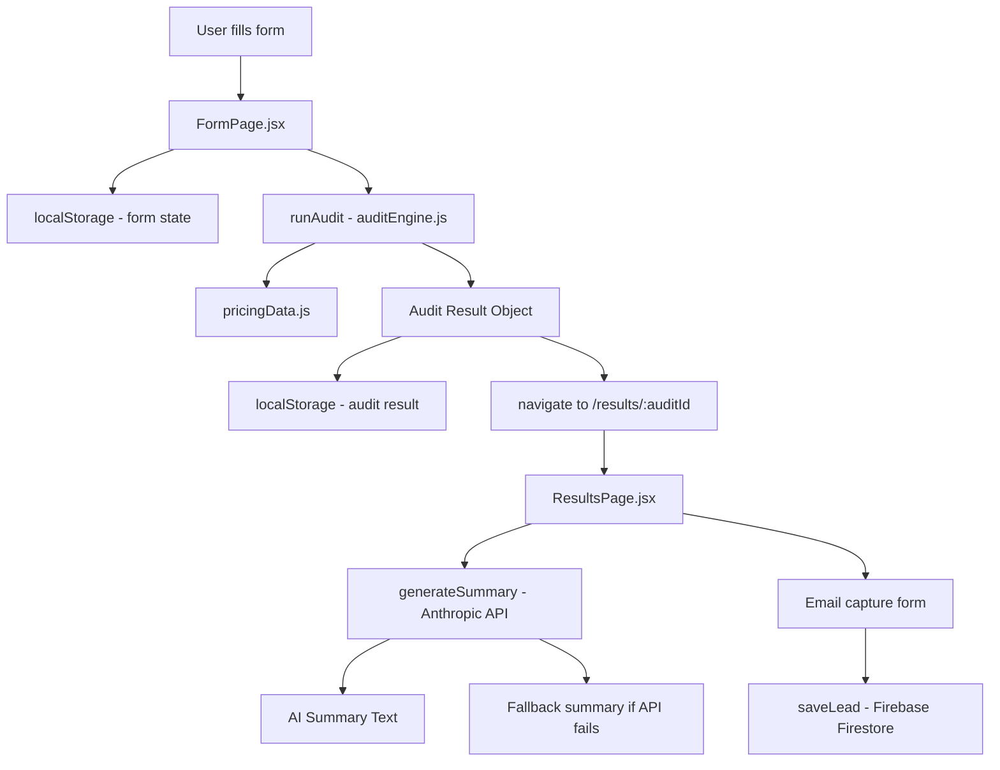

# Architecture

## System Diagram

## Data Flow

1. User inputs tool data in FormPage
2. Form state persists to localStorage on every change
3. On submit — `runAudit()` processes inputs through rule-based engine
4. Result saved to localStorage with a UUID key
5. User navigated to `/results/{uuid}`
6. ResultsPage reads audit from localStorage using UUID from URL
7. Anthropic API called with audit context to generate summary
8. If API fails — fallback template summary shown
9. Email submission saves lead to Firebase Firestore

## Why I chose this stack

- **React + Vite** — fastest dev experience, I have prior experience with React from RozgarHub and SplitUp projects
- **TailwindCSS** — utility-first, fast to iterate on UI
- **Firebase Firestore** — no backend server needed, real-time, free tier sufficient
- **localStorage for audit state** — avoids needing a backend for the shareable URL feature; UUID acts as the key
- **Anthropic API** — required by assignment; claude-sonnet-4 gives best quality summaries at reasonable token cost
- **Vercel** — zero config deployment, auto-deploys on git push

## What I'd change at 10k audits/day

- Move audit storage from localStorage to a real database (Supabase/Postgres)
- Add Redis caching for repeated audit patterns
- Rate limiting at the API gateway level
- CDN for static assets
- Server-side rendering for OG preview pages so scrapers can read audit data
- Separate the Anthropic API call to a backend endpoint to protect the API key