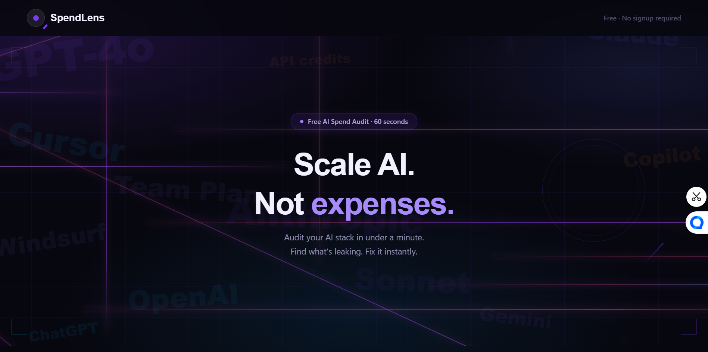
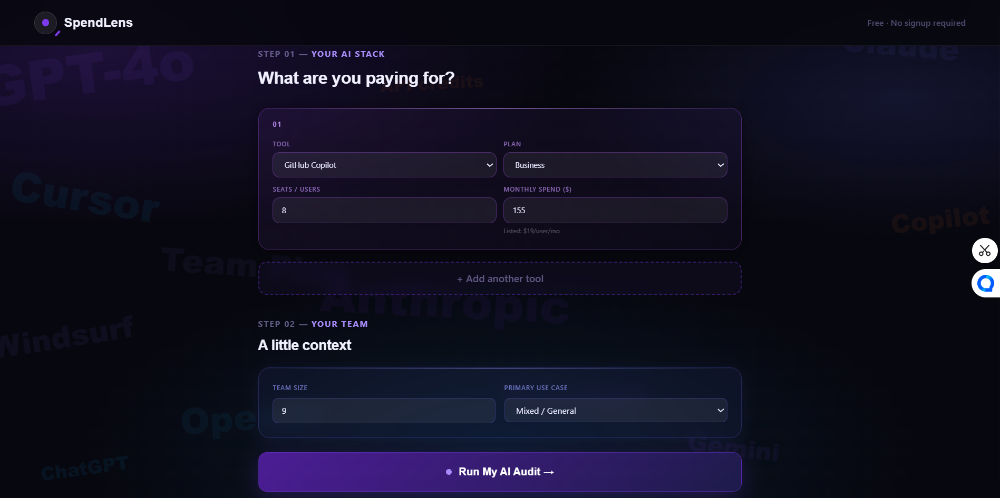
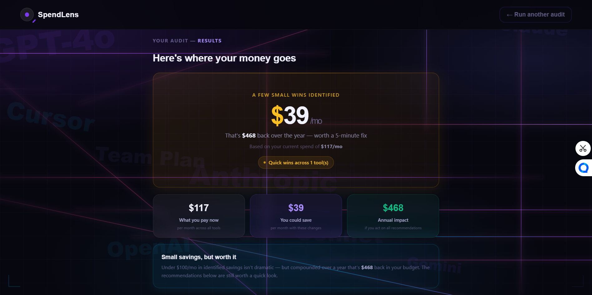
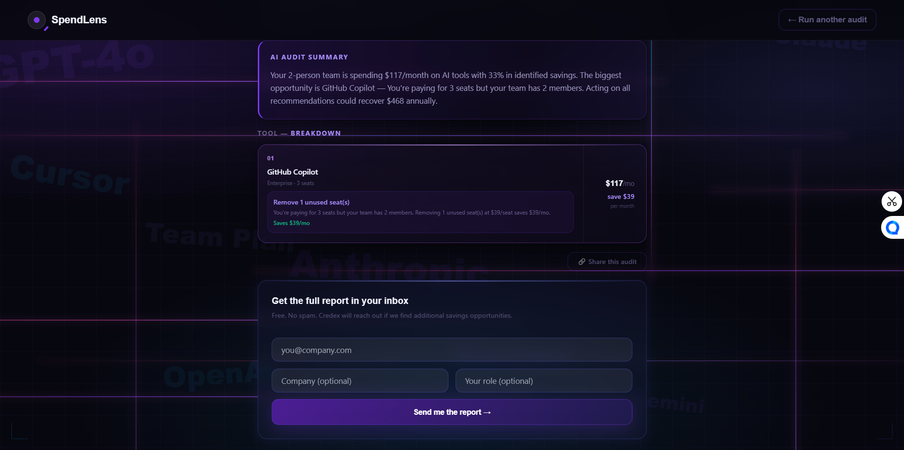

# SpendLens — AI Spend Audit Tool

Find out if you're overpaying for AI tools in under a minute. Free audit for startups and engineering teams.

---

## Screenshots

### Landing Page


### Audit Form


### Results Page — Savings Overview


### Results Page — Tool Recommendations


---

## Quick Start

```bash
npm install
npm run dev
```

## Deploy

```bash
npm run build
```

Deploy to Vercel — connect GitHub repo, add environment variables, deploy.

## Environment Variables

```env
VITE_ANTHROPIC_API_KEY=
VITE_FIREBASE_API_KEY=
VITE_FIREBASE_AUTH_DOMAIN=
VITE_FIREBASE_PROJECT_ID=
VITE_RESEND_API_KEY=
```

See `.env.example` for the full list.

## Decisions

1. **localStorage over backend for audit state** — Shareable URLs work via UUID keys in localStorage. Avoids needing a backend for the read path. Tradeoff: audits expire when browser data is cleared.

2. **Hardcoded rules over AI for audit logic** — The assignment noted that knowing when NOT to use AI is part of the test. Rule-based logic is auditable, explainable, and fast. A finance person can read it and agree or disagree.

3. **React + Vite over Next.js** — Familiarity and speed. No SSR needed for this tool since OG tags are static and audit data lives in localStorage.

4. **Firebase Firestore over Supabase** — Prior experience from personal projects. Free tier is sufficient. Tradeoff: no SQL, harder to query analytically.

5. **Graceful fallback for Anthropic API** — If the API fails, a template summary generates from the same audit data. App never shows a broken state. Tradeoff: fallback is less personalized.

## Architecture

- Frontend: React (Vite) — chosen for fast SPA performance and simple state handling for form + results flow
- State: Local state + localStorage persistence (no backend required for MVP flow)
- Audit Engine: Rule-based deterministic logic (no AI dependency for core scoring)
- AI Layer: Used only for personalized summary generation (graceful fallback if API fails)
- Backend: Firebase (Firestore) for lead capture + storage
- Deployment: Vercel with environment-based configuration

## Tech Stack

- React
- Vite
- TailwindCSS
- Firebase
- Vitest
- GitHub Actions
- Vercel

## Live URL

https://spendlens-pink.vercel.app

